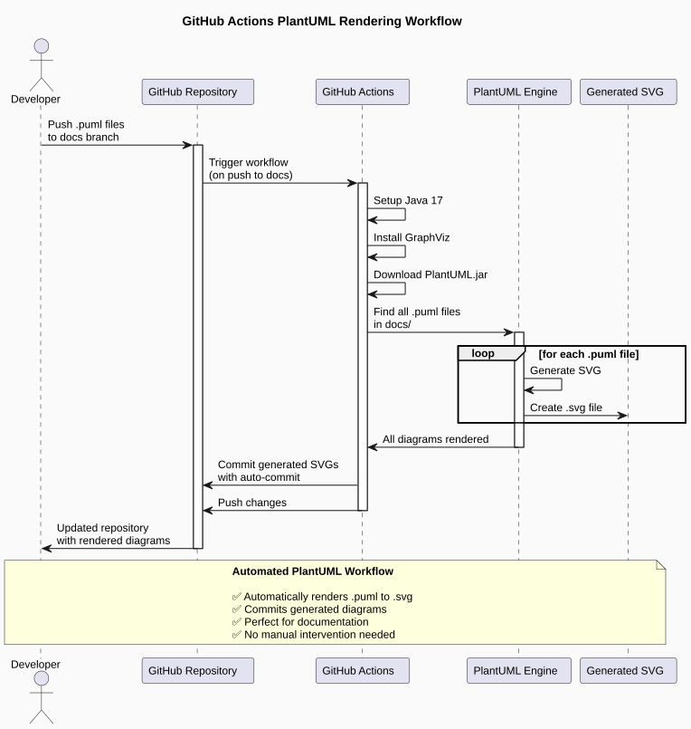

# PlantUML-GithubAction-Demo
A small demo on how to embed PlantUML diagrams on the fly with Github Actions

## 🎯 Demo: Automated PlantUML Diagram Generation

This repository demonstrates how to automatically generate SVG diagrams from PlantUML source files using GitHub Actions. Every time you push `.puml` files to the `docs` branch, the workflow automatically renders them to SVG format and commits them back to the repository.

### 📊 Workflow Visualization

The following diagram shows how the automated PlantUML rendering process works:



### 🚀 How it works

1. **Push PlantUML files** - Developer pushes `.puml` files to the `docs` branch
2. **Trigger GitHub Action** - The workflow automatically starts on push
3. **Setup Environment** - Java 17 and GraphViz are installed
4. **Download PlantUML** - Latest PlantUML JAR is downloaded
5. **Generate Diagrams** - All `.puml` files are converted to `.svg`
6. **Auto-commit** - Generated SVG files are automatically committed back

### 📁 File Structure

```text
docs/
├── github-actions-plantuml-workflow.puml  # Source PlantUML file
└── github-actions-plantuml-workflow.svg   # Auto-generated SVG (after workflow runs)
```

### 🔧 Usage

1. Create your PlantUML diagrams in `docs/` with `.puml` extension
2. Push to the `docs` branch
3. The GitHub Action will automatically generate SVG files
4. Include the generated SVGs in your documentation

Perfect for blog posts, documentation, and automated diagram generation! 🎉
